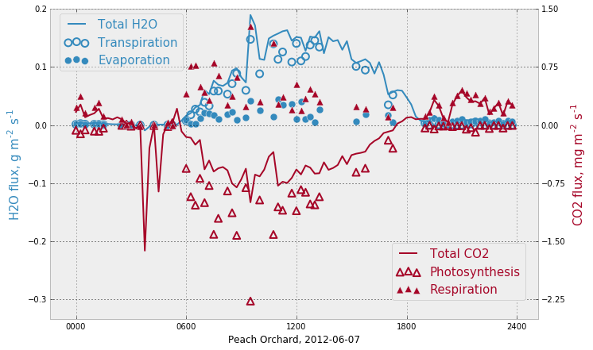
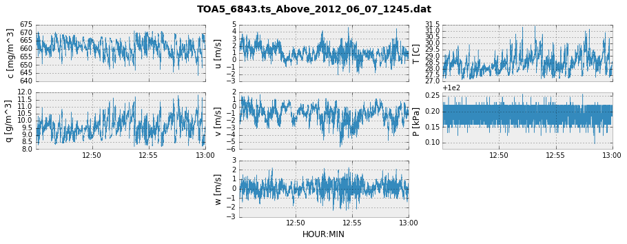
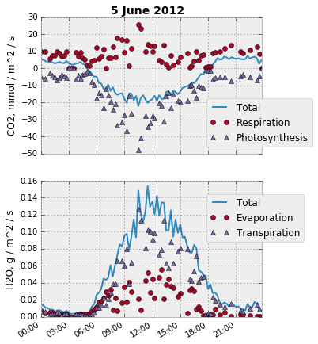
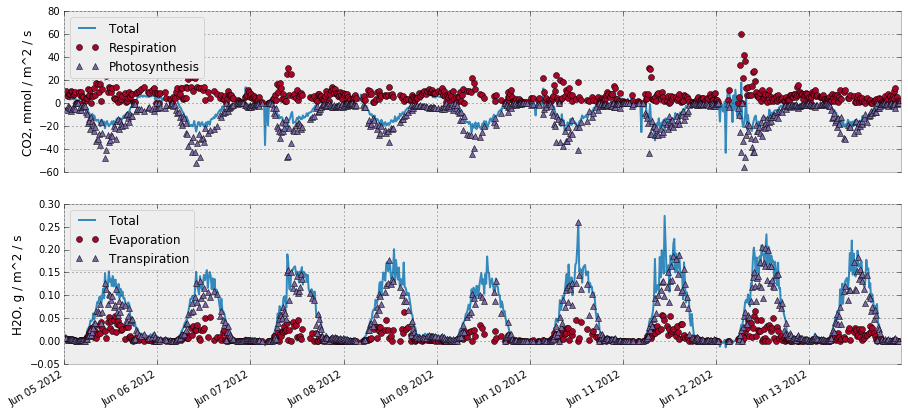
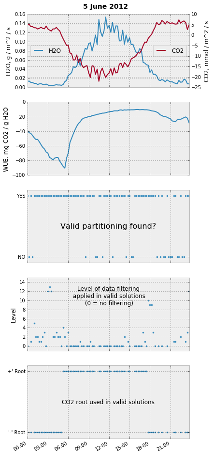

.. _fluxpart-tutorial:

========
Tutorial
========

**Fluxpart** is a Python 3 module that implements the Scanlon and Sahu
[SS08]_ method for partitioning water vapor and carbon dioxide fluxes into
stomatal and nonstomatal components, e.g.:

This tutorial assumes a basic familiarity with the Python_ programming
language, the SciPy_ ecosystem, and the flux partitioning procedure developed
in [SS08]_.  A brief review of flux partitioning is given in [TODO:
Background.rst]. A more complete explanation can be found in the articles
listed in :ref:`fluxpart-literature`.

.. _Python: https://www.python.org
.. _SciPy: https://www.scipy.org

Quickstart
----------

The plots show the contents of :file:`TOA5_6843.ts_Above_2012_06_07_1245.dat`,
a delimited text file containing 15 minutes of high-frequency (20 Hz)  eddy
covariance data for water vapor (*q*) and carbon dioxide (*c*) concentrations,
air pressure (*P*), air temperature (*T*), and wind velocity (*u*, *v*, *w*),
i.e.:

.. code-block:: none

    "TOA5","6843","CR3000","6843","CR3000.Std.22","CPU:CA_Flux__GOOD.CR3","24006","ts_Above"
    "TIMESTAMP","RECORD","Ux","Uy","Uz","co2","h2o","Ts","press","diag_csat"
    "TS","RN","m/s","m/s","m/s","mg/m^3","g/m^3","C","kPa","m/s"
    "","","Smp","Smp","Smp","Smp","Smp","Smp","Smp","Smp"
    "2012-06-07 12:45:00.05",111850400,2.00875,-1.59625,-0.4375,667.4865,8.788113,27.65771,100.2198,0
    "2012-06-07 12:45:00.1",111850401,2.0785,-1.67175,-0.401,667.3378,8.806417,27.74078,100.1938,0
    "2012-06-07 12:45:00.15",111850402,2.43675,-1.799,-0.22375,667.3351,8.808785,27.66119,100.1744,0
      ...,
      ...,
      ...,
    "2012-06-07 13:00:00",111868399,0.5987501,-0.68275,0.2965,659.7935,9.531489,28.50967,100.1841,0

Time-average partitioned fluxes for the 15 min interval are found by::

    >>> import fluxpart as fp
    >>> out = fp.flux_partition(
    ...     fname='TOA5_6843.ts_Above_2012_06_07_1245.dat',
    ...     delimiter=",",
    ...     skip_header=4,
    ...     cols=(2, 3, 4, 6, 5, 7, 8),
    ...     unit_convert={
    ...         'q': 1e-3,
    ...         'c': 1e-6,
    ...         'P': 1e3},
    ...     temper_unit='C',
    ...     sitedata={
    ...         'meas_ht': 7.11,
    ...         'canopy_ht': 4.42,
    ...         'ppath': 'C3'},
    ...     ci_mod='const_ppm')
    >>> print(out['fluxes'])
    Fluxes(
        Fq = 0.1299 g/m^2/s,
        Fqt = 0.119 g/m^2/s,
        Fqe = 0.01094 g/m^2/s,
        Fc = -0.5135 mg/m^2/s,
        Fcp = -0.8504 mg/m^2/s,
        Fcr = 0.3369 mg/m^2/s,
        LE = 316.2 W/m^2,
        LEt = 289.5 W/m^2,
        LEe = 26.63 W/m^2,
        Fc_mol = -11.67 umol/m^2/s,
        Fcp_mol = -19.32 umol/m^2/s,
        Fcr_mol = 7.655 umol/m^2/s)

Notation and Definitions
------------------------

The following notation is used in variable naming and documentation to
represent meteorological quantities:

.. code-block:: none

    u, v, w = horizontal (u, v) and veritcal (w) wind velocities
    q = water vapor mass concentration
    c = carbon dioxide mass concentration
    T = air temperature
    P = total air pressure

The partitioning algorithm processes high-frequency eddy covariance data to
determine interval average values for the water vapor and carbon dioxide
fluxes:

.. code-block:: none

    Fq = <w'q'> = Total H2O vapor flux
    Fqe = <w'qe'> = Nonstomatal component of H2O vapor flux (evaporation)
    Fqt = <w'qt'> = Stomatal component of vapor flux (transpiration)
    Fc =  <w'c'> = Total CO2 flux
    Fcr = <w'cr'> = Nonstomatal component of CO2 flux (respiration)
    Fcp = <w'cp'> = Stomatal component of CO2 flux (photosynthesis)

A prime indicates the fluctuation of a scalar quantity and angle brackets
indicate time averaging over an interval (e.g. 0.25 to 1 h).

The following definitions, relations, and requirements exist:

.. code-block:: none

    Fq = Fqe + Fqt
    Fc = Fcr + Fcp
    Fqe > 0
    Fqt > 0
    Fcr > 0
    Fcp < 0
    WUE = Fcp/Fqt < 0

where ``WUE`` is leaf-level water use efficiency.

Partitioning with :func:`~fluxpart.fluxpart.flux_partition`
-----------------------------------------------------------

A complete flux partitioning procedure is implemented in the function
:func:`~fluxpart.fluxpart.flux_partition`.

The full procedure involves:

-  Reading high-frequency eddy covariance data
-  Performing basic data QA/QC
-  Making necessary data transformations (unit conversions, external effects
   corrections)
-  Estimating WUE if measurements are not available
-  Seeking a physically acceptable partitioning solution, progressively
   removing low frequency components from data as needed to conform with flux
   variance similarity assumptions

:func:`~fluxpart.fluxpart.flux_partition` has many parameters that specify how
these procedures are performed.  To get started, we'll consider the Quickstart_
example in detail.

Quickstart revisited
~~~~~~~~~~~~~~~~~~~~

The call to :func:`~fluxpart.fluxpart.flux_partition` in the Quickstart_
example  was::

    >>> out = fp.flux_partition(
    ...     fname='TOA5_6843.ts_Above_2012_06_07_1245.dat',
    ...     delimiter=",",
    ...     skip_header=4,
    ...     cols=(2, 3, 4, 6, 5, 7, 8),
    ...     unit_convert={
    ...         'q': 1e-3,
    ...         'c': 1e-6,
    ...         'P': 1e3},
    ...     temper_unit='C',
    ...     sitedata={
    ...         'meas_ht': 7.11,
    ...         'canopy_ht': 4.42,
    ...         'ppath': 'C3'},
    ...     ci_mod='const_ppm')

The arguments in the function call (``fname``, ``delimiter``, etc.) specify the
file format of the high-frequency eddy covariance data that will be read, as
well as various details about the flux partitioning analysis that is to be
performed.  Let's look at these parameters by group.

Parameters for data reading
^^^^^^^^^^^^^^^^^^^^^^^^^^^

::

    ...     fname='TOA5_6843.ts_Above_2012_06_07_1245.dat',
    ...     delimiter=",",
    ...     skip_header=4,
    ...     cols=(2, 3, 4, 6, 5, 7, 8),

``fname`` is a **required** string variable specifying the name of the high
frequency data file. The file must be a delimited text file (binary data files
are on the TODO list), with one data record per line. If the data file is not
in the current working directory, ``fname`` must include full path
information (e.g. ``fname='C:/users/todd/mydata.dat'`` or
``fname='/home/todd/mydata.dat'``).

``delimiter`` is an optional parameter that indicates the string used to
delimit data fields. By default, any consecutive whitespaces act as the
delimiter. The Quickstart_ example uses instead a comma delimited format.

``skip_header`` is an optional parameter specifying the number of lines to
skip at the beginning of the data file. The Quickstart_ datafile has 4 lines of
headers before the numerical time series data start, so we skip 4 lines. The
default is to not skip any lines.

The **required** parameter ``cols`` is a tuple of 7 integers that indicates
the columns in ``fname`` that contain series data for (u, v, w, q, c, T, P),
in that order. 0-based indexing is used (meaning the first column is referred
to as column 0).  In the Quickstart_ example, the data file has 10 columns. The
first two (columns 0 and 1) hold timestamp and record information, and the last
(column 9) is a flag.  The remaining 7 columns are 2=u, 3=v, 4=w, 6=q, 5=c,
7=T, and 8=P, so ``cols=(2, 3, 4, 6, 5, 7, 8)``.

Many additional data file formatting options can be specified. **Fluxpart**
uses numpy.genfromtxt_ to read text files, and any keyword arguments given to
:func:`~fluxpart.fluxpart.flux_partition` that are not
:func:`~fluxpart.fluxpart.flux_partition` parameters are passed to
numpy.genfromtxt_. See numpy.genfromtxt_ for a full listing of available
options.

.. _numpy.genfromtxt:
    http://docs.scipy.org/doc/numpy/reference/generated/numpy.genfromtxt.html

Parameters for data conversion and QA/QC
^^^^^^^^^^^^^^^^^^^^^^^^^^^^^^^^^^^^^^^^

::

    ...     unit_convert={
    ...         'q': 1e-3,
    ...         'c': 1e-6,
    ...         'P': 1e3},
    ...     temper_unit='C',

By default, **fluxpart** assumes the u, v, w, q, c, P, and T data are in SI
units (m/s, kg/m^3, Pa, K). If any of the units for u, v, w, q, c, or P are
different (note T is not in that list), it is necessary to provide numerical
factors for converting those data to the required units.  The
``unit_convert`` parameter is a dictionary of conversion factors with keys
corresponding to the variable name ('w', 'q', 'P', etc.). In the Quickstart_
example, the wind velocities were in the correct units (m/s), but q (g/m^3), c
(mg/m^3), and P (kPa) needed to be converted, so we specified::

    unit_convert = {'q': 1e-3, 'c': 1e-6, 'P': 1e3}

The data are multipled by the provided constant (e.g., the ``q`` data in units
of g/m^3 are multipled by 1e-3 to obtain kg/m^3). ``unit_convert`` is
optional if all data are in SI units.  Temperature units are handled
separately. If the T data need to be converted from degrees C to K, this is
accomplished by setting ``temper_unit`` to 'C'.

A related optional parameter is ``correcting_external``, which is a boolean
parameter that determines if the water vapor and carbon dioxide series data are
to be corrected for external fluctuations associated with air temperature and
vapor density. The default is ``correcting_external=True``.

:func:`~fluxpart.fluxpart.flux_partition` has a number of additional optional
parameters that can be used to perform basic quality checks on the high
frequency data.  The parameter ``bounds`` can be used to specify lower
and/or upper bounds for legal data.  Data entries are rejected if they fall
outside the bounds.  The ``flags`` parameter can be used to identify one or
more columns in *fname* that are used to flag bad data records.  If the data
file contains bad records (not readable, out-of-bounds, or flagged data), the
partitioning analysis is performed using the longest stretch of consecutive
good data records found, unless that stretch is too short, in which case the
analysis is aborted. The criteria for judging 'too short' is defined by the
parameters ``rd_tol`` and ``ad_tol``.  See
:func:`~fluxpart.fluxpart.flux_partition` for a full explanation of these
QA/QC parameters.

Parameters for estimating WUE
^^^^^^^^^^^^^^^^^^^^^^^^^^^^^

::

    ...     sitedata={
    ...         'meas_ht': 7.11,
    ...         'canopy_ht': 4.42,
    ...         'ppath': 'C3'},
    ...     ci_mod='const_ppm')

If a measured or otherwise known value for leaf-level water use efficiency is
available, it is passed to :func:`~fluxpart.fluxpart.flux_partition` using the
``meas_wue`` parameter (in units of kg CO2/ kg H2O). Otherwise, it is
necessary to provide field site meta data that are used to estimate WUE. The
parameter ``sitedata`` is a dictionary that must contain values for the
following three keys::

    'meas_ht' : float, Eddy covariance measurement height (meters)
    'canopy_ht' : float, Plant canopy height (meters)
    'ppath' : {'C3' or 'C4'}, Photosynthetic pathway

``sitedata`` is required unless a value for ``meas_wue`` is provided, in
which case ``sitedata`` can be set to None.

If WUE is being estimated by **fluxpart**, the optional ``ci_mod``
parameter can be used to specify the model and parameter values to be used to
estimate the intercellular CO2 concentration.  See
:func:`~fluxpart.wue.water_use_efficiency` for a full description of
``ci_mod``. In the Quickstart_ example, the ``'const_ppm'`` model is used with
default parameter values. The default is ``ci_mod='const_ratio'``.

Partitioning results
~~~~~~~~~~~~~~~~~~~~

The function :func:`~fluxpart.fluxpart.flux_partition` returns a dictionary
(which, in the Quickstart_ example,was given the name ``out``).  The results
dictionary has 7 fields: ``'result'``, ``'fluxes'``, ``'datsumm'``,
``'wue'``, ``'numsoln'``, ``'qcdat'``, and ``'label'``.

'result'
^^^^^^^^

The ``'result'`` element is a :class:`~fluxpart.containers.Result`
namedtuple that contains information about the overall outcome of the
partitioning:

::

    >>> print(out['result'])
    Result(
        dataread = True,
        valid_partition = True,
        mssg = )

The ``dataread`` and  ``valid_partition`` attributes are booleans
indicating success/failure in reading the high-frequency data and obtaining a
valid partitioning solution. The string ``mssg`` is a possibly informative
message if either ``dataread`` or ``valid_partition`` are False.

'fluxes'
^^^^^^^^

The ``'fluxes'`` entry is a :class:`~fluxpart.containers.Fluxes` namedtuple
containing the partitioned fluxes expressed in mass, latent heat, and molar
units.

::

    >>> print(out['fluxes'])
    Fluxes(
        Fq = 0.1299 g/m^2/s,
        Fqt = 0.119 g/m^2/s,
        Fqe = 0.01094 g/m^2/s,
        Fc = -0.5135 mg/m^2/s,
        Fcp = -0.8504 mg/m^2/s,
        Fcr = 0.3369 mg/m^2/s,
        LE = 316.2 W/m^2,
        LEt = 289.5 W/m^2,
        LEe = 26.63 W/m^2,
        Fc_mol = -11.67 umol/m^2/s,
        Fcp_mol = -19.32 umol/m^2/s,
        Fcr_mol = 7.655 umol/m^2/s)

'datsumm'
^^^^^^^^^

``'datsumm'`` is a :class:`~fluxpart.containers.HFSummary` namedtuple that
contains a summary of the high-frequency data (various averages, variances,
etc.). ``'datsumm'`` summarizes the data series being used in the partitioning
analysis, which may not be the entire data file if, e.g., the file contains bad
data.

::

    >>> print(out['datsumm'])
    HFSummary(
        T = 28.4 C,
        P = 100.2 kPa,
        Pvap = 1.328 kPa,
        ustar = 0.3902 m/s,
        wind_w = 0.0525 m/s,
        var_w = 0.303 (m/s)^2,
        rho_vapor = 9.545 g/m^3,
        rho_co2 = 661.3 mg/m^3,
        var_vapor = 0.4225 (g/m^3)^2,
        var_co2 = 6.669 (mg/m^3)^2,
        Fq = 0.1524 g/m^2/s,
        Fc = -0.5479 mg/m^2/s,
        H = 176.5 W/m^2,
        LE = 370.9 W/m^2,
        Fc_mol = -12.45 umol/m^2/s,
        rho_dryair = 1.142 kg/m^3,
        rho_totair = 1.152 kg/m^3,
        cov_w_T = 0.1515 C m/s,
        N = 16384)

'wue'
^^^^^

The ``'wue'`` element is a :class:`~fluxpart.containers.WUE` namedtuple
containing a summary of the water use efficiency calculation::

    >>> print(out['wue'])
    WUE(
        wue = -7.147 mg/g,
        inter_h2o = 28.07 g/m^3,
        inter_co2 = 492.4 mg/m^3,
        ambient_h2o = 12.6 g/m^3,
        ambient_co2 = 650.4 mg/m^3,
        vpd = 2.54 kPa,
        ci_mod = ('const_ppm', 280.0),
        ppath = C3,
        meas_ht = 7.11 m,
        canopy_ht = 4.42 m)

See :class:`~fluxpart.containers.WUE` for an explanation of the various
attributes.

'numsoln'
^^^^^^^^^

``'numsoln'`` is a :class:`~fluxpart.containers.NumerSoln` tuple with 
information about the numerical solution::

    >>> print(out['numsoln'])
    NumerSoln(
        corr_cp_cr = -0.8918,
        var_cp = 14.72 (mg/m^3)^2,
        sig_cr = 1.704 mg/m^3,
        co2soln_id = 1,
        validroot = True,
        validmssg = ,
        init = (-0.8, 8.28),
        success = True,
        mssg = The solution converged.,
        nfev = 14)

See :class:`~fluxpart.containers.NumerSoln` for an explanation of the
attributes.

'qcdat'
^^^^^^^

The ``'qcdat'`` entry is a :class:`~fluxpart.containers.QCData` tuple holding
summary information about the eddy covariance data for q and c. Whereas
``'datsumm'`` contains information about the data in ``fname``, the values in
``'qcdat'`` are for the q and c series data analyzed in the final partitioning
calculation, which may have been filtered to remove low-frequency (large scale)
components.

.. code-block:: python

    >>> print(out['qcdat'])
    QCData(
        var_q = 0.3442 (g/m^3)^2,
        var_c = 5.962 (mg/m^3)^2,
        corr_qc = -0.9345,
        wq = 0.1299 g/m^2/s,
        wc = -0.5135 mg/m^2/s,
        wave_lvl = (11, 14))

The attribute ``wave_lvl`` is a 2-tuple of integers indicating the level of
filtering that was applied to the data. The second number is the maximum
wavelet decomposition level that could be applied to the data (a value that
depends on the length of the data series). The first is the number of
components *remaining* in the data. So ``wave_lvl = (14, 14)``, for example,
means that the analyzed data had not been filtered (all 14 data components were
present).  ``wave_lvl = (11, 14)`` means that the 3 largest scale components
of the data were removed in the final analysis.

Notice that the total vapor (Fq) and carbon (Fc) fluxes in 'fluxes' are not
identical to those in 'datsumm':

.. code-block:: python

    >>> print("'datsumm' Fq = {}\n'fluxes'  Fq = {}\n'datsumm' Fc = {}\n'fluxes'  Fc = {}\n"
    ...       "".format(out['datsumm'].Fq, out['fluxes'].Fq, out['datsumm'].Fc, out['fluxes'].Fc))

    'datsumm' Fq = 0.0001524116170671735
    'fluxes'  Fq = 0.000129915690383154
    'datsumm' Fc = -5.478948520584087e-07
    'fluxes'  Fc = -5.134651239546627e-07

The reason is that filtering the w, q, and c data has affected their
covariances (and hence the apparent fluxes).
:func:`~fluxpart.fluxpart.flux_partition` has an optional boolean
parameter **adjusting_fluxes** that when set to True causes the final
partitioned fluxes to be adjusted so that the total partitioned fluxes match
exactly the fluxes indicated in the original data (Default is False).

.. code-block:: python

    >>> adjout = fp.flux_partition(
        fname='TOA5_6843.ts_Above_2012_06_07_1245.dat',
        delimiter=",",
        skip_header=4,
        cols=(2, 3, 4, 6, 5, 7, 8),
        unit_convert={
            'q': 1e-3,
            'c': 1e-6,
            'P': 1e3},
        temper_unit='C',
        sitedata={
            'meas_ht': 7.11,
            'canopy_ht': 4.42,
            'ppath': 'C3'},
        ci_mod='const_ppm',
        adjusting_fluxes=True)  # <-  Add adjusting_fluxes

    # Now the total fluxes in 'datsumm' and 'fluxes' match
    >>> print("'datsumm' Fq = {}\n'fluxes'  Fq = {}\n'datsumm' Fc = {}\n'fluxes'  Fc = {}\n"
    ...       "".format(adjout['datsumm'].Fq, adjout['fluxes'].Fq, adjout['datsumm'].Fc, adjout['fluxes'].Fc))

    'datsumm' Fq = 0.0001524116170671735
    'fluxes'  Fq = 0.0001524116170671735
    'datsumm' Fc = -5.478948520584087e-07
    'fluxes'  Fc = -5.478948520584087e-07

'label'
^^^^^^^^

The ``'label'`` results entry is simply whatever was passed to
:func:`~fluxpart.fluxpart.flux_partition` using the **label** parameter.  The
**label** parameter is useful for giving a name or date/time to the data and/or
result (see :ref:`tutorial-example`). The optional **label** parameter was not
specified in the Quickstart_ example, so in this case ``out['label']`` is an
empty string.

String representations of output
^^^^^^^^^^^^^^^^^^^^^^^^^^^^^^^^

All elements of the **fluxpart** output have printed string representations
that provide formatting and may use common units for certain attributes, but
the actual object holds all dimensioal data in SI units.  As an example, we can
compare the actual and printed ``'fluxes'`` from the Quickstart_ example::

    >>> out['fluxes']
    Fluxes(Fq=0.000129915690383154, Fqt=0.00011897421956218071,
    Fqe=1.0941470820973289e-05, Fc=-5.1346512395466272e-07,
    Fcp=-8.503583133011449e-07, Fcr=3.3689318934648218e-07,
    LE=316.16065398786844, LEt=289.53367336569829, LEe=26.62698062217012,
    Fc_mol=-1.1667010314807151e-05, Fcp_mol=-1.9321933953672914e-05,
    Fcr_mol=7.6549236388657623e-06)

    >>> print(out['fluxes'])
    Fluxes(
        Fq = 0.1299 g/m^2/s,
        Fqt = 0.119 g/m^2/s,
        Fqe = 0.01094 g/m^2/s,
        Fc = -0.5135 mg/m^2/s,
        Fcp = -0.8504 mg/m^2/s,
        Fcr = 0.3369 mg/m^2/s,
        LE = 316.2 W/m^2,
        LEt = 289.5 W/m^2,
        LEe = 26.63 W/m^2,
        Fc_mol = -11.67 umol/m^2/s,
        Fcp_mol = -19.32 umol/m^2/s,
        Fcr_mol = 7.655 umol/m^2/s)

.. _tutorial-example:

Example
-------

In this example, the directory ``/home/todd/data`` holds 9 days of high
frequency eddy covariance data, obtained in a peach orchard, 5-13 June 2012.
There are 96 data files per day, each containing 15 min of high-frequency data,
for a total of 9 * 96 = 864 data files.

The naming scheme for the data files is:
``TOA5_6843.ts_Above_2012_06_DD_HHMM.dat``, where the day ``DD`` ranges from 05
to 13, the hour ``HH`` from 00 to 23, and the minute ``MM`` cycles through {00,
15, 30, 45}.

In the following, a short Python script is used to loop over the files, apply
the :func:`~fluxpart.fluxpart.flux_partition` routine, and save the results in
a list.  Matplotlib_ is used to view some results.

The format of every data file is identical and we want to apply the same
analysis to each one, so in our loop the only
:func:`~fluxpart.fluxpart.flux_partition` arguments that change are the data
file name and the label that we will be assigning to each result.  It is
convenient to define a wrapper function that defines all the fixed
:func:`~fluxpart.fluxpart.flux_partition` arguments and has only the two varying
parameters:

.. code-block:: python

    import fluxpart as fp
    def my_partition(datafile, timestamp):
        return fp.flux_partition(
            fname=datafile,
            cols=(2,3,4,6,5,7,8),
            sitedata={'meas_ht': 7.11, 'canopy_ht': 4.42, 'ppath': 'C3'},
            unit_convert={'q':1e-3, 'c':1e-6, 'P':1e3},
            temper_unit='C',
            ci_mod='const_ppm',
            skip_header=4,
            delimiter=",",
            flags=(9, 0),
            label=timestamp)

The following code applies ``my_partition`` to each data file and saves the
results in a list called ``fpout``,  using a Python datetime object as the
label for each result:

.. code-block:: python

    import os
    import datetime

    fpout = []
    DATADIR = "/home/todd/data"
    for dd in range(5, 14):
        for hh in range(0, 24):
            for mm in range(0, 60, 15):
                filename = "TOA5_6843.ts_Above_2012_06_{:02}_{:02}{:02}.dat".format(dd, hh, mm)
                datafile = os.path.join(DATADIR, filename)
                timestamp = datetime.datetime(2012, 6, dd, hh, mm)
                fpout.append(my_partition(datafile, timestamp))

It took about 4 min on a desktop computer to complete the analysis of the 864
data files. We now examine the results in ``fpout``. Consider the contents of
an arbitrarily chosen result, the 151st element of ``fpout``::

    >>> for v in fpout[150].values():
    ...     print(v)
    2012-06-06 13:30:00
    HFSummary(
        T = 23.9 C,
        P = 100.2 kPa,
        Pvap = 1.177 kPa,
        ustar = 0.3113 m/s,
        wind_w = 0.01727 m/s,
        var_w = 0.2455 (m/s)^2,
        rho_vapor = 8.587 g/m^3,
        rho_co2 = 671.4 mg/m^3,
        var_vapor = 0.407 (g/m^3)^2,
        var_co2 = 12.39 (mg/m^3)^2,
        Fq = 0.1508 g/m^2/s,
        Fc = -0.839 mg/m^2/s,
        H = 246.9 W/m^2,
        LE = 368.6 W/m^2,
        Fc_mol = -19.06 umol/m^2/s,
        rho_dryair = 1.162 kg/m^3,
        rho_totair = 1.17 kg/m^3,
        cov_w_T = 0.2088 C m/s,
        N = 16384)
    WUE(
        wue = -10.7 mg/g,
        inter_h2o = 21.78 g/m^3,
        inter_co2 = 500.0 mg/m^3,
        ambient_h2o = 11.71 g/m^3,
        ambient_co2 = 654.0 mg/m^3,
        vpd = 1.788 kPa,
        ci_mod = ('const_ppm', 280.0),
        ppath = C3,
        meas_ht = 7.11 m,
        canopy_ht = 4.42 m)
    Result(
        dataread = True,
        valid_partition = True,
        mssg = )
    NumerSoln(
        corr_cp_cr = -0.8983,
        var_cp = 18.79 (mg/m^3)^2,
        sig_cr = 0.9334 mg/m^3,
        co2soln_id = 1,
        validroot = True,
        validmssg = ,
        init = (-0.8, 17.21),
        success = True,
        mssg = The solution converged.,
        nfev = 12)
    QCData(
        var_q = 0.407 (g/m^3)^2,
        var_c = 12.39 (mg/m^3)^2,
        corr_qc = -0.9586,
        wq = 0.1508 g/m^2/s,
        wc = -0.839 mg/m^2/s,
        wave_lvl = (14, 14))
    Fluxes(
        Fq = 0.1508 g/m^2/s,
        Fqt = 0.09719 g/m^2/s,
        Fqe = 0.05362 g/m^2/s,
        Fc = -0.839 mg/m^2/s,
        Fcp = -1.04 mg/m^2/s,
        Fcr = 0.2012 mg/m^2/s,
        LE = 368.6 W/m^2,
        LEt = 237.5 W/m^2,
        LEe = 131.1 W/m^2,
        Fc_mol = -19.06 umol/m^2/s,
        Fcp_mol = -23.63 umol/m^2/s,
        Fcr_mol = 4.572 umol/m^2/s)

The starting point for evaluating any
:func:`~fluxpart.fluxpart.fluxpart.flux_partition` output is the
``valid_partition`` attribute of ``'results'``.  ``valid_partition`` is a
boolean that indicates whether the partitioning was a success.  This particular
example was a success::

    >>> fpout[150]['result'].valid_partition
    True

The percentage of successful partitioning outcomes for all 864 results in
``fpout`` can be determined from::

    >>> 100 * sum(out['result'].valid_partition for out in fpout) / len(fpout)
    71.75925925925925

So the paritioning algorithm was successful analyzing about 72% of 15 min data
intervals. A lack of success in a particular case is most often due to the time
series data not yielding a partitioning solution that satisfies all physical
requirements/assumptions, but failure can also occur due to other reasons such
as an inability to read the data file. The ``mssg`` attribute in
``'result'`` may help identify the cause of ``valid_partition = False``.

The success rate can also be broken out by day::

    >>> list(100 * sum(r['result'].valid_partition for r in fpout[i:i+96])
    ...      / len(fpout[i:i+96]) for i in range(0, 9 * 96, 96))
    [78.125,
     67.70833333333333,
     75.0,
     66.66666666666667,
     61.458333333333336,
     66.66666666666667,
     71.875,
     76.04166666666667,
     82.29166666666667]

Thus the success rate varied over the 9 days, ranging from about 61% to 82%.

The ``'fluxes'`` element holds the final obtained fluxes. If the partitioning
was unsuccessful, the fluxes are given as a numpy nan::

    >>> fpout[50]['result'].valid_partition
    False
    >>> fpout[50]['fluxes']
    Fluxes(Fq=nan, Fqt=nan, Fqe=nan, Fc=nan, Fcp=nan, Fcr=nan, LE=nan, LEt=nan, LEe=nan, Fc_mol=nan, Fcp_mol=nan, Fcr_mol=nan)

On the other hand, the ``'qcdat'``, ``'numsoln'``, and ``'wue'`` elements of a
:func:`~fluxpart.fluxpart.flux_partition` result are not necessarily set to nan
or another flag in the event of an unsuccessful partition. Instead, they may
reflect the state of the computation on the final attempt at locating a valid
solution. Thus some care is needed when considering ``'qcdat'``, ``'numsoln'``,
and ``'wue'`` elements in isolation as it might not be obvious whether the
output is for a successful or unsuccessful outcome. In this case, one needs to
cross-check ``valid_partition`` in ``'result'``.

Matplotlib can be used to visualize the partitioned fluxes in ``fpout``.  Here,
we view results for the first day (the first 96 data files).  Notice in the
following that the data for the total fluxes (Fq and Fc) are being taken from
``'datsumm'`` rather than ``'fluxes'``.  The reason is that ``'datsumm'`` has
the total flux for every 15 min interval, whereas ``'fluxes'`` has (non-nan)
resutls only for intervals where the partitioning was successful. Note also the
numerical multiplication factors being used to convert SI units before
plotting.

::

    import matplotlib.pyplot as plt
    import matplotlib.dates as mdates
    plt.style.use('bmh')

    pdata = fpout[:96]

    fig, (ax0, ax1) = plt.subplots(2, 1, figsize=(5,7))
    times = list(r['label'] for r in pdata)

    fcr = list(1e6 * r['fluxes'].Fcr_mol for r in pdata)
    fcp = list(1e6 * r['fluxes'].Fcp_mol for r in pdata)
    fc = list(1e6 * r['datsumm'].Fc_mol for r in pdata)

    fqe = list(1e3 * r['fluxes'].Fqe for r in pdata)
    fqt = list(1e3 * r['fluxes'].Fqt for r in pdata)
    fq = list(1e3 * r['datsumm'].Fq for r in pdata)

    ax0.plot(times, fc, label='Total')
    ax0.plot(times, fcr, 'o', label='Respiration')
    ax0.plot(times, fcp, '^', label='Photosynthesis')

    ax1.plot(times, fq, label='Total')
    ax1.plot(times, fqe, 'o', label='Evaporation')#, markerfacecolor='None')
    ax1.plot(times, fqt, '^', label='Transpiration')

    ax0.set_ylabel("CO2, mmol / m^2 / s")
    ax1.set_ylabel("H2O, g / m^2 / s")
    ax1.xaxis.set_major_formatter(mdates.DateFormatter('%H:%M'))
    ax0.legend(loc=(.75,0.05))
    ax1.legend(loc=(.75,0.55))
    fig.suptitle("5 June 2012", fontsize=14, fontweight='bold')
    plt.subplots_adjust(top=0.95)
    plt.gcf().autofmt_xdate()
    plt.show()

Equivalent results for the whole nine days can be viewed with:

.. code-block:: python

    pdata = fpout

    fig, (ax0, ax1) = plt.subplots(2, 1, figsize=(15,7))
    times = list(r['label'] for r in pdata)

    fcr = list(1e6 * r['fluxes'].Fcr_mol for r in pdata)
    fcp = list(1e6 * r['fluxes'].Fcp_mol for r in pdata)
    fc = list(1e6 * r['datsumm'].Fc_mol for r in pdata)

    fqe = list(1e3 * r['fluxes'].Fqe for r in pdata)
    fqt = list(1e3 * r['fluxes'].Fqt for r in pdata)
    fq = list(1e3 * r['datsumm'].Fq for r in pdata)

    ax0.plot(times, fc, label='Total')
    ax0.plot(times, fcr, 'o', label='Respiration')
    ax0.plot(times, fcp, '^', label='Photosynthesis')

    ax1.plot(times, fq, label='Total')
    ax1.plot(times, fqe, 'o', label='Evaporation')
    ax1.plot(times, fqt, '^', label='Transpiration')

    ax0.set_ylabel("CO2, mmol / m^2 / s")
    ax1.set_ylabel("H2O, g / m^2 / s")
    ax0.legend(loc=2)
    ax1.legend(loc=2)
    plt.gcf().autofmt_xdate()
    plt.show()

Some summary measures for fluxes can be calculated, such as the fraction of the
total water flux associated with transpiration. In the calculation below,
``trans`` and ``et`` will contain some nan's due to data intervals with
unsuccessful partitioning, so we use ``numpy.nansum``, which converts nan's to
zero when summing. Note the total water flux in the denominator (called `et`)
is derived from the ``'fluxes'`` result and not ``'datsumm'``, so that
total includes values only from intervals where partitioning was successful.

::

    >>> # calculate 100 * T / ET over all 9 days
    >>> import numpy as np
    >>> trans = list(r['fluxes'].Fqt for r in fpout)
    >>> et = list(r['fluxes'].Fq for r in fpout)
    >>> 100 * np.nansum(trans) / np.nansum(et)
    80.671716497175761

So over the 9 days about 81% of the total water vapor flux was associated with
transpiraiton. Evaluated on a day-by-day basis, one obtains the following::

    >>> list(100 * np.nansum(trans[i:i+96]) / np.nansum(et[i:i+96]) for i in range(0, 9 * 96, 96))
    [70.154921393670719,
     79.244547452892576,
     82.940435031568072,
     80.520300424685203,
     81.003364970592884,
     81.187924381961892,
     80.542893168310414,
     83.171898349220655,
     85.729487557438844]

Besides fluxes, other output of note includes the time courses of: the
estimated water use efficiency; successful/unsuccessful results; the level of
data filtering applied in successful solutions; and the numerical root used to
obtain a successful solution:

::

    pdata = fpout[:96]
    fig, ax = plt.subplots(5, 1, figsize=(6, 16))
    times = list(r['label'] for r in pdata)

    # H2O and CO2 fluxes
    fc = list(1e6 * r['datsumm'].Fc_mol for r in pdata)
    fq = list(1e3 * r['datsumm'].Fq for r in pdata)
    ax[0].plot(times, fc, label='CO2')
    ax0t = ax[0].twinx()
    ax0t.plot(times, fq, label='H2O',  c='r')
    ax[0].set_ylabel("CO2, mmol / m^2 / s")
    ax0t.set_ylabel("H2O, g / m^2 / s")
    ax[0].legend(loc=6)
    ax0t.legend(loc=5)

    # Water use efficiency
    wue = list(1e3 * r['wue'].wue for r in pdata)
    ax[1].plot(times, wue)
    ax[1].set_ylim([-100,0])
    ax[1].set_ylabel("WUE, mg CO2 / g H2O")

    # Valid partitioning solution found?
    isvalid = list(r['result'].valid_partition for r in pdata)
    ax[2].plot(times, isvalid, '.')
    ax[2].set_ylim([-0.1,1.1])
    ax[2].yaxis.set_ticks([0,1])
    ax[2].yaxis.set_ticklabels(["NO", "YES"])
    ax[2].text(0.5, 0.5, "Valid partitioning found?",
               horizontalalignment='center',verticalalignment='center', transform=ax[2].transAxes, fontsize=16)

    # Level of filtering applied in *valid solutions*
    wave_lvl = list(r['qcdat'].wave_lvl[1] - r['qcdat'].wave_lvl[0] if r['result'].valid_partition else None for r in pdata)
    ax[3].plot(times, wave_lvl, '.')
    ax[3].set_ylim([-1,15])
    ax[3].text(0.5, 0.75, "Level of data filtering\n applied in valid solutions\n (0 = no filtering)",
               horizontalalignment='center',verticalalignment='center', transform=ax[3].transAxes, fontsize=12)
    ax[3].set_ylabel("Level")

    # Which root was used in the successful calculation
    co2soln = list(r['numsoln'].co2soln_id if r['result'].valid_partition else None for r in pdata)
    ax[4].plot(times, co2soln, '.')
    ax[4].set_ylim([-0.1,1.1])
    ax[4].yaxis.set_ticks([0,1])
    ax[4].yaxis.set_ticklabels(["'-' Root", "'+' Root"])
    ax[4].xaxis.set_major_formatter(mdates.DateFormatter('%H:%M'))
    ax[4].text(0.5, 0.5, "CO2 root used in valid solutions",
               horizontalalignment='center',verticalalignment='center', transform=ax[4].transAxes, fontsize=12)

    fig.suptitle("5 June 2012", fontsize=14, fontweight='bold')
    plt.subplots_adjust(top=0.96)
    plt.gcf().autofmt_xdate()
    plt.show()

